# CompilerC0

>   考虑到有些图片等内容显示不全，有pdf文档
>
>   github地址：https://github.com/chen2511/CompilerC0

[TOC]

## 零、文件说明

-   global.h：全局数据结构、全局变量

-   scan.h：词法分析关键函数声明

-   scan.cpp：词法分析实现
-   parser.cpp：语法分析：递归下降分析
-   parser.h：语法分析关键函数声明


### 0.1 统计信息


## 一、词法分析：

>   理论来自louden书和哈工大慕课、ppt和曾老师的课堂

>   文件：scan.h;scan.cpp

### 1.1 分析思路

理论：

>   文法》正则表达式》NFA》DFA》DFA最小化》编程实现

分为三种类型：保留字、特殊符号（运算符等等）、其他（数字、标识符、字符串、字符）

>   把保留字先看作标识符、再进行识别
>
>   所以，识别特殊符号、无符号数字、标识符、字符串、字符即可

#### 正则表达式

数字：`[1-9][0-9]*|0`

标识符：`[_a-zA-Z][_a-zA-Z0-9]*`

运算符：

```
+ - * / 
&&  '||'  !
< <= > >= != == 
= ： , ; [ ] { } ( ) 
```

字符：`'[<加法运算符>｜<乘法运算符>｜<字母>｜<数字>]'`

字符串：`"｛十进制编码为32,33,35-126的ASCII字符｝"`

#### NFA


#### DFA

>   比较简单。。。。似乎不用什么操作了


### 1.2 数据结构

#### Token

```c++
typedef struct{
    TokenType opType;
    char * value;
}Token;
```


#### TokenType

枚举类型

```c++
typedef enum {
    //关键字：
    CHAR, CONST, ELSE, FALSE, FOR,              //0-4
    IF, INT, MAIN, PRINTF, RETURN,              //5-9
    SCANF, TRUE, VOID, WHILE,                   //10-13
    NUM, IDEN, LETTER, STRING,                  //14-17:数字、标识符、字符、字符串
    PLUS, MINU, MULT, DIV,                      //18-21:+ - * /
    AND, OR, NOT,                               //22-24:&& || !
    LSS, LEQ, GRE, GEQ, NEQ, EQL,               //25-30关系运算符: < <= > >= != ==
    ASSIGN, COLON, COMMA, SEMICOLON,            //31-34: =  :  ,  ;
    LBRACE, RBRACE, LBRACKET, RBRACKET,         //35-38:{ } [ ]
    LPARENTHES, RPARENTHES,                     //39-40:( )                                         
}TokenType;
```

#### 保留字表

```c++
const char* reservedWords[] = {
    "case", "char", "const", "default", "else",
    "false", "for", "if", "int", "main",
    "printf", "return", "scanf", "switch", "true",
    "void", "while"
};
```

#### 状态

```c++
typedef enum {
    STATE_START, STATE_NUM, STATE_ID, STATE_CHAR, STATE_STRING, STATE_DONE
}StateType;
```


### 1.3 DFA编程思想

>   来自louden书的思路

#### 1、隐含状态

注意`advance the input`表示读入一个符号


#### 2、双重case

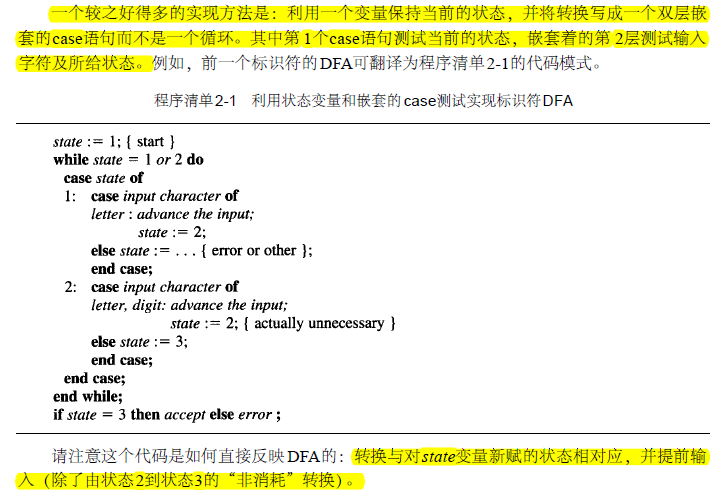

#### 3、转换表


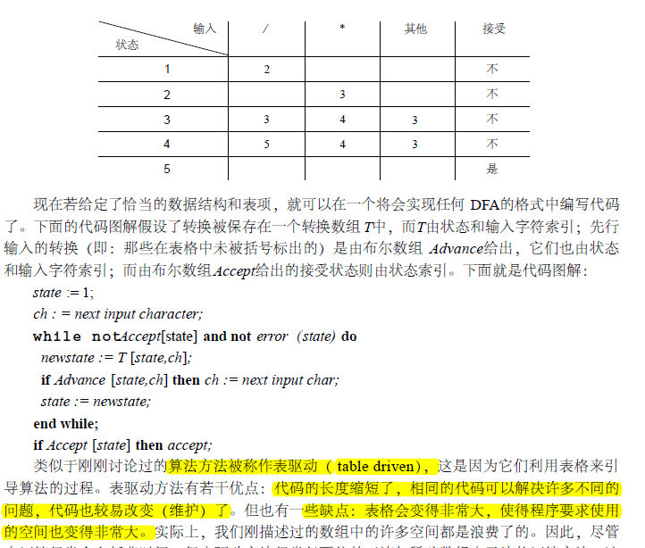


### 1.4 注意问题：

#### 1、读入缓冲

>   缓冲的意思是，不是直接通过指针操作，而是，先读进来一个数组的数据，在数组中操作；
>
>   然后有单缓冲和双缓冲的区别；而北航是多了一个backup数组；
>
>   louden书中的例子，也是有一个缓冲数组lineBuf


#### 2、保留字的识别

>   先看做标识符，再识别保留字；
>
>   保留字表，字典序查询

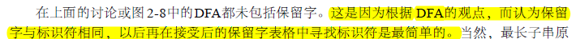

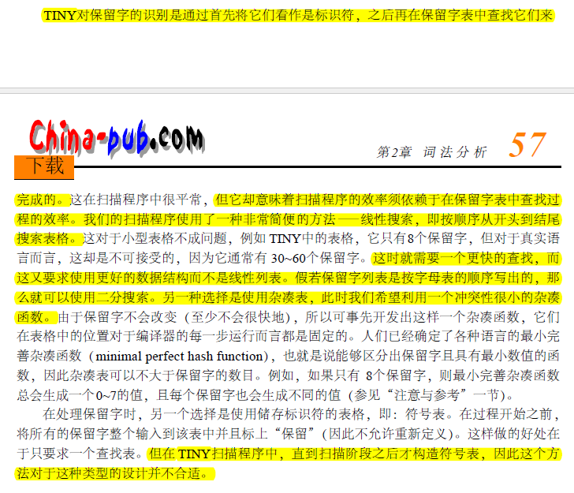

保留字表；

如果比较大，就用二分查找

#### 3、带符号数处理

>   +1+1
>
>   第二个 +1和第一个+1是有区别的，词法分析阶段识别带符号数，最长字串原则，会有问题

##### 分析：

带符号整数出现于变量定义时，这个地方不会存在问题，语法分析时处理；

另一个是位于表达式中：

>   数学上的形式：其中要么带符号数要么在开头，要么有括号；其他情况数字都是无符号的

因为表达式开头有符号定义，可以忽略这个；

而对于带符号数在表达式内部，肯定实在括号内部，所以又可以递归回去，用开头的符号；

所以总结起来也是语法分析阶段处理

还有就是布尔表达式的地方，也是单独分析

##### 处理方法

放到语法分析中处理带符号数

#### 3、冲突解决


#### 4、错误处理


## 二、语法分析

### 2.1 文法改造

>   这一部分 花了大量时间，需要验证文法的可行性；以及编程的可行性

#### 二义性

-   if else
-   表达式

>   解决办法：改造文法和EBNF

>   未发现其他二义性的地方

#### 左递归

可以较为容易地判断出：没有直接和间接左递归。

#### 回溯

通过改造文法（简单的改造，提取公共左因子；但为了直观、更方便处理，有的不改造了）或者  算法处理（if else 进一步判断，判断后回溯，感觉思想类似LL(n)了，事实上就没有消除回溯）

#### 计算FIRST和FOLLOW集

>   可以用于选择、重复的case判断


#### EBNF

EBNF更适合递归下降分析法

例如：

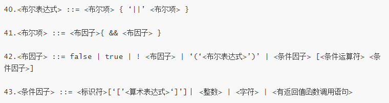


### 2.2 编程思想

#### 基本方法

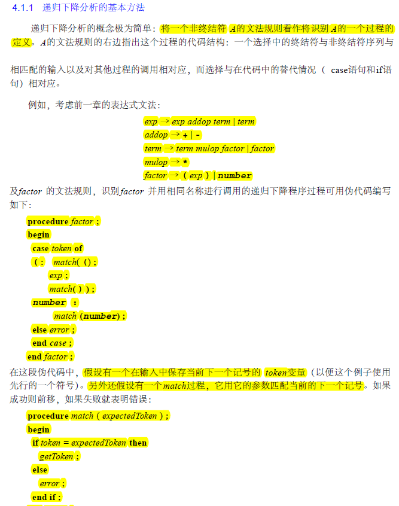

>   case选择不同的，遇到终结符，就match；非终结符就调用函数

#### 重复和选择：使用EBNF

>   这里面的判断条件是根据 first集的 或者 空语句的时候，就要follow集
>
>   总之就是一个要求：根据当前token，进入一个确定的分支，没有回溯

##### 可选结构

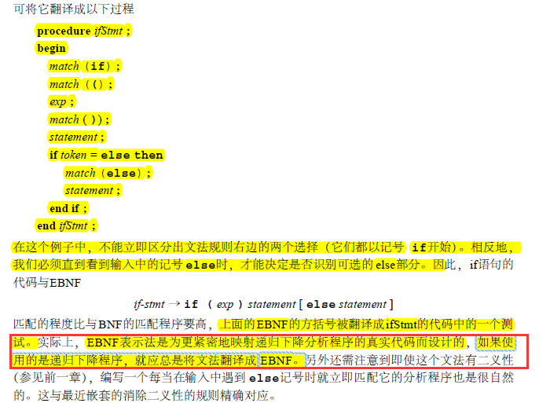

##### 重复结构

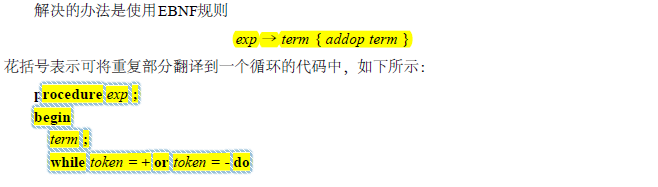

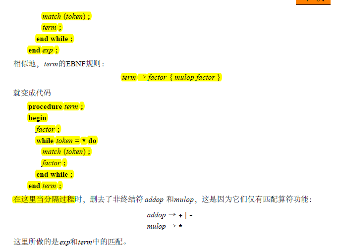

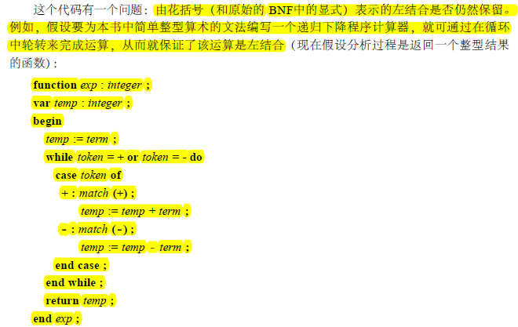


### 2.3 数据结构

#### AST

未打算使用抽象语法树，因为发现可以不使用抽象语法树，直接转IR（三地址码等），可能建立起来还会多此一举；而且考虑到未发现统一的语法树结构定义，而且文法不同，也要做出改变。

但可能不直观，不知道分析结果。所以调试代码的时候，只能写一部分代码，然后进行针对性的单元测试。


#### 回溯指针

```c++
static int flashBackIndex;
```


### 2.4 关键函数

#### 匹配终结符函数

```c++
// 匹配 期待的 token；否则报错
// 读取下一个token
static void match(TokenType expectToken)
```

#### 非终结符过程

```c++
//为每一个非终结符创建一个函数
void program();

void constDeclaration();
void constDefine();
void varDeclaration();
void varDefine();
void typeID();
void functionDefinitionWithReturn();
void DeclarationHead();
void functionDefinitionWithoutReturn();
void paraTable();
void complexSentense();
void mainFunction();

void signedNum();

void statementSequence();
void statement();
void assignStatement();
void ifStatement();
void loopStatement();
void callWithReturn();
void callWithoutReturn();
void valueParaTable();
void readStatement();
void writeStatement();
void returnStatement();

void exp();
void term();
void factor();
void boolExp();
void boolTerm();
void boolFactor();
void conditionFactor();
```


### 2.5 注意问题

#### 1、公共因子

```
13.<程序> ::= ［<常量说明>］［<变量说明>］{<有返回值函数定义>|<无返回值函数定义>}<主函数>
```

这一部分为了 文法上的简便，没有进行公共因子的提取；

选择类似LL(n)的方法，一次性往后看好多

分三段，设flag


#### 2、单元测试

-   常、变量说明

类型测试、多条语句测试、是否函数定义测试

-   函数定义（语句列为空）

函数定义选择测试、结构测试、参数表、复合语句测试（实际上空语句）

-   语句列、语句
-   表达式：算术、布尔

#### 3、错误处理

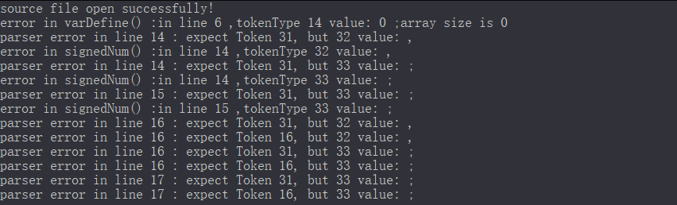

发现：

要是少了一些token，继续往下匹配，还能成功继续；（token不动，分析继续）

但是有时候，比如int写成in，有时候死活下不去


### 2.6 抽象语法树AST

>   因为一开始没有这个打算，这是临时加的，所以放到最后了。

先根据 语法定义手动画出可能的抽象语法树；

然后结合图和文法，设计数据结构；

之后再验证数据结构


表达式策略：计算时只有三种节点：操作（+-*/数组、call、取负）、数字（字符也当作数字运算）、标识符

如果是赋值会进行截断处理；比较时都是整形

>   终于明白为什么参数个数一致即可；int转char截断即可；char转int扩展；所以只需要记录个数


## 三、语义分析

>   一遍的编译器中，词法分析、语法分析、语义分析是同时进行的
>
>   再生成抽象语法树之后，再遍历抽象语法树，构建符号表，进行语义分析

编译器的语义分析阶段的任务是：将变量的定义与它们的各个使用联系起来，检查每一个表达式是否有正确的类型，将抽象语法转换成更简单的、适合于生成机器代码的表示

语义分析阶段的一个主要工作是符号表的管理，其作用是将标识符映射到它们的类型和储存位置。


>   是否需要同Type字段，比如赋值时，确定最终发类型


