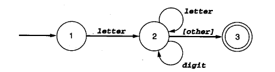
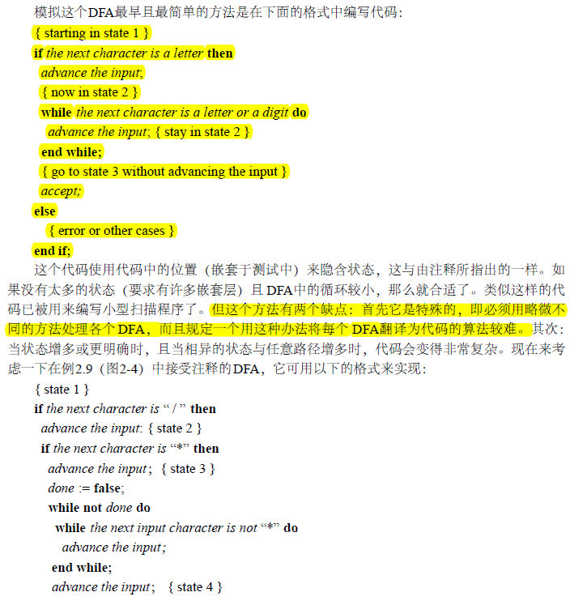
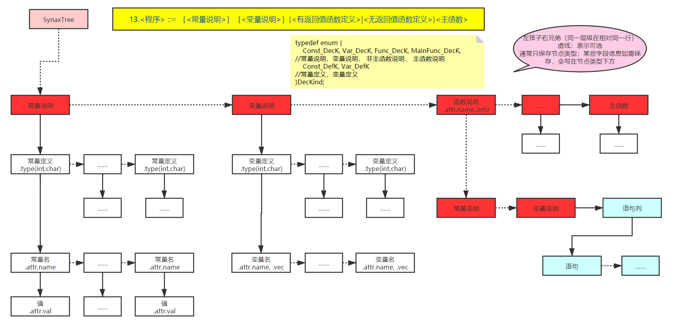
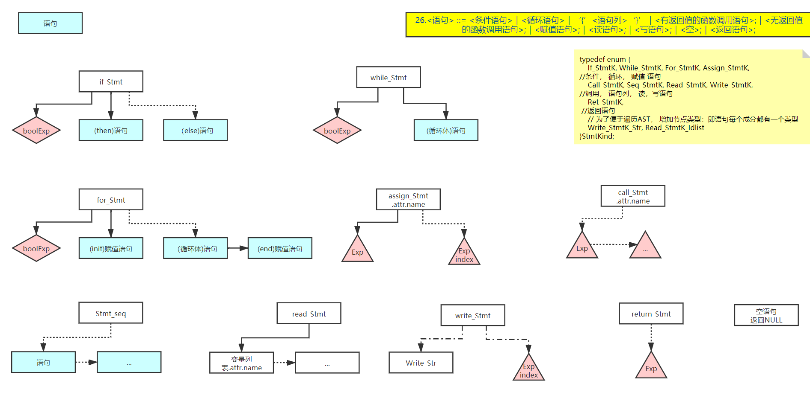
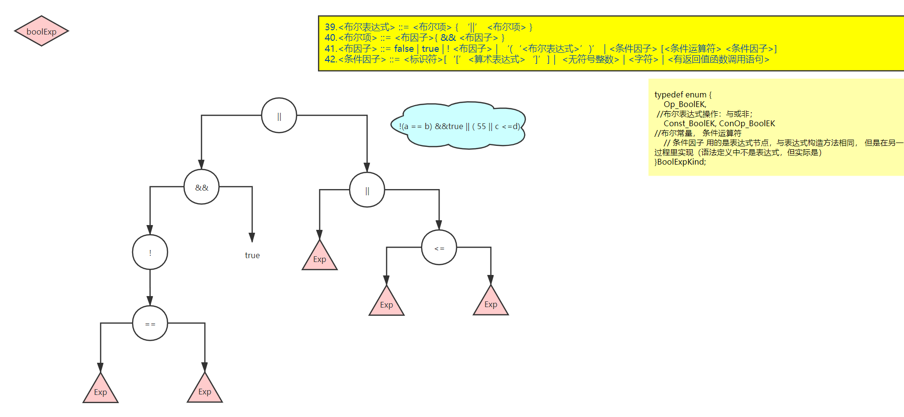
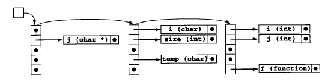
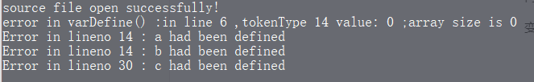
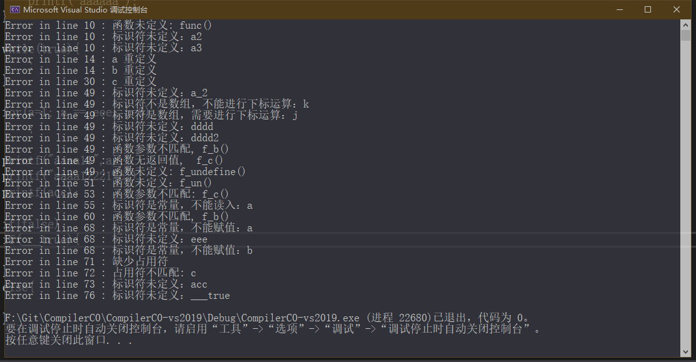

# CompilerC0

>   考虑到有些图片等内容显示不全，有pdf文档
>
>   github地址：https://github.com/chen2511/CompilerC0

[TOC]

## 零、文件说明

-   global.h：全局数据结构、全局变量
-   scan.h：
-   scan.cpp：词法分析实现
-   parser.h：
-   parser.cpp：语法分析：递归下降分析
-   ast.h：
-   ast.cpp：AST创建不同类型节点、输出AST
-   symtab.h：
-   symtab.cpp：符号表基本操作：插入、查找、初始化
-   semantic.h：
-   semantic.cpp：遍历AST，构建符号表、语义检查


### 0.1 统计信息


## 一、词法分析：

>   理论来自louden书和哈工大慕课、ppt和曾老师的课堂

>   文件：scan.h;scan.cpp

### 1.1 分析思路

理论：

>   文法》正则表达式》NFA》DFA》DFA最小化》编程实现

分为三种类型：保留字、特殊符号（运算符等等）、其他（数字、标识符、字符串、字符）

>   把保留字先看作标识符、再进行识别
>
>   所以，识别特殊符号、无符号数字、标识符、字符串、字符即可

#### 正则表达式

数字：`[1-9][0-9]*|0`

标识符：`[_a-zA-Z][_a-zA-Z0-9]*`

运算符：

```
+ - * / 
&&  '||'  !
< <= > >= != == 
= ： , ; [ ] { } ( ) 
```

字符：`'[<加法运算符>｜<乘法运算符>｜<字母>｜<数字>]'`

字符串：`"｛十进制编码为32,33,35-126的ASCII字符｝"`

#### NFA


#### DFA

>   比较简单。。。。似乎不用什么操作了


### 1.2 数据结构

#### Token

```c++
typedef struct{
    TokenType opType;
    char * value;
}Token;
```


#### TokenType

枚举类型

```c++
typedef enum {
    //关键字：
    CHAR, CONST, ELSE, FALSE, FOR,              //0-4
    IF, INT, MAIN, PRINTF, RETURN,              //5-9
    SCANF, TRUE, VOID, WHILE,                   //10-13
    NUM, IDEN, LETTER, STRING,                  //14-17:数字、标识符、字符、字符串
    PLUS, MINU, MULT, DIV,                      //18-21:+ - * /
    AND, OR, NOT,                               //22-24:&& || !
    LSS, LEQ, GRE, GEQ, NEQ, EQL,               //25-30关系运算符: < <= > >= != ==
    ASSIGN, COLON, COMMA, SEMICOLON,            //31-34: =  :  ,  ;
    LBRACE, RBRACE, LBRACKET, RBRACKET,         //35-38:{ } [ ]
    LPARENTHES, RPARENTHES,                     //39-40:( )                                         
}TokenType;
```

#### 保留字表

```c++
const char* reservedWords[] = {
    "case", "char", "const", "default", "else",
    "false", "for", "if", "int", "main",
    "printf", "return", "scanf", "switch", "true",
    "void", "while"
};
```

#### 状态

```c++
typedef enum {
    STATE_START, STATE_NUM, STATE_ID, STATE_CHAR, STATE_STRING, STATE_DONE
}StateType;
```


### 1.3 DFA编程思想

>   来自louden书的思路

#### 1、隐含状态

注意`advance the input`表示读入一个符号





#### 2、双重case


#### 3、转换表


### 1.4 注意问题：

#### 1、读入缓冲

>   缓冲的意思是，不是直接通过指针操作，而是，先读进来一个数组的数据，在数组中操作；
>
>   然后有单缓冲和双缓冲的区别；而北航是多了一个backup数组；
>
>   louden书中的例子，也是有一个缓冲数组lineBuf


#### 2、保留字的识别

>   先看做标识符，再识别保留字；
>
>   保留字表，字典序查询


保留字表；

如果比较大，就用二分查找

#### 3、带符号数处理

>   +1+1
>
>   第二个 +1和第一个+1是有区别的，词法分析阶段识别带符号数，最长字串原则，会有问题

##### 分析：

带符号整数出现于变量定义时，这个地方不会存在问题，语法分析时处理；

另一个是位于表达式中：

>   数学上的形式：其中要么带符号数要么在开头，要么有括号；其他情况数字都是无符号的

因为表达式开头有符号定义，可以忽略这个；

而对于带符号数在表达式内部，肯定实在括号内部，所以又可以递归回去，用开头的符号；

所以总结起来也是语法分析阶段处理

还有就是布尔表达式的地方，也是单独分析

##### 处理方法

放到语法分析中处理带符号数

#### 3、冲突解决


#### 4、错误处理


## 二、语法分析

### 2.1 文法改造

>   这一部分 花了大量时间，需要验证文法的可行性；以及编程的可行性

#### 2.1.1 二义性

-   if else
-   表达式

>   解决办法：改造文法和EBNF

>   未发现其他二义性的地方

#### 2.1.2 左递归

可以较为容易地判断出：没有直接和间接左递归。

#### 2.1.3 回溯

通过改造文法（简单的改造，提取公共左因子；但为了直观、更方便处理，有的不改造了）或者  算法处理（if else 进一步判断，判断后回溯，感觉思想类似LL(n)了，事实上就没有消除回溯）

#### 2.1.4 计算FIRST和FOLLOW集

>   可以用于选择、重复的case判断


#### 2.1.5 EBNF

EBNF更适合递归下降分析法

例如：


### 2.2 编程思想

#### 2.2.1 基本方法


>   case选择不同的，遇到终结符，就match；非终结符就调用函数

#### 2.2.2 重复和选择：使用EBNF

>   这里面的判断条件是根据 first集的 或者 空语句的时候，就要follow集
>
>   总之就是一个要求：根据当前token，进入一个确定的分支，没有回溯

##### 可选结构


##### 重复结构


### 2.3 数据结构

#### 2.3.1 AST

未打算使用抽象语法树，因为发现可以不使用抽象语法树，直接转IR（三地址码等），可能建立起来还会多此一举；而且考虑到未发现统一的语法树结构定义，而且文法不同，也要做出改变。

但可能不直观，不知道分析结果。所以调试代码的时候，只能写一部分代码，然后进行针对性的单元测试。


#### 2.3.2 回溯指针

```c++
static int flashBackIndex;
```


### 2.4 关键函数

#### 2.4.1 匹配终结符函数

```c++
// 匹配 期待的 token；否则报错
// 读取下一个token
static void match(TokenType expectToken)
```

#### 2.4.2 非终结符过程

```c++
//为每一个非终结符创建一个函数
void program();

void constDeclaration();
void constDefine();
void varDeclaration();
void varDefine();
void typeID();
void functionDefinitionWithReturn();
void DeclarationHead();
void functionDefinitionWithoutReturn();
void paraTable();
void complexSentense();
void mainFunction();

void signedNum();

void statementSequence();
void statement();
void assignStatement();
void ifStatement();
void loopStatement();
void callWithReturn();
void callWithoutReturn();
void valueParaTable();
void readStatement();
void writeStatement();
void returnStatement();

void exp();
void term();
void factor();
void boolExp();
void boolTerm();
void boolFactor();
void conditionFactor();
```


### 2.5 注意问题

#### 2.5.1、公共因子

```
13.<程序> ::= ［<常量说明>］［<变量说明>］{<有返回值函数定义>|<无返回值函数定义>}<主函数>
```

这一部分为了 文法上的简便，没有进行公共因子的提取；

选择类似LL(n)的方法，一次性往后看好多

分三段，设flag


#### 2.5.2、单元测试

-   常、变量说明

类型测试、多条语句测试、是否函数定义测试

-   函数定义（语句列为空）

函数定义选择测试、结构测试、参数表、复合语句测试（实际上空语句）

-   语句列、语句
-   表达式：算术、布尔

#### 2.5.3、错误处理


发现：

要是少了一些token，继续往下匹配，还能成功继续；（token不动，分析继续）

但是有时候，比如int写成in，有时候死活下不去


### 2.6 抽象语法树AST

>   因为一开始没有这个打算，这是临时加的，所以放到最后了。

#### 2.6.1 设计抽象语法树

先根据 语法定义手动画出可能的抽象语法树；

>   高清图可查看svg



语句：



表达式


布尔表达式



#### 2.6.2 数据结构

然后结合图和文法，设计数据结构；

大体说明：总的有四种类型：DecK, StmtK, ExpK, BoolExpK（NodeKind nodekind; 字段保存）

具体类型：union确定

```c++
#define MAX_TREENODE_CHILD_NUM  3                       // 最大孩子节点数
#define MAX_PARAMETERE_NUM      8                       // 最大参数个数

typedef enum {
    DecK, StmtK, ExpK, BoolExpK                         //声明，语句，表达式，布尔表达式
}NodeKind;

typedef enum {
    Const_DecK, Var_DecK, Func_DecK, MainFunc_DecK,         //常量说明，变量说明， 非主函数说明， 主函数说明
    Const_DefK, Var_DefK                                    //常量定义，变量定义
}DecKind;

typedef enum {
    If_StmtK, While_StmtK, For_StmtK, Assign_StmtK,         //条件， 循环， 赋值 语句
    Call_StmtK, Seq_StmtK, Read_StmtK, Write_StmtK,         //调用， 语句列， 读，写语句
    Ret_StmtK,                                              //返回语句
    // 为了便于遍历AST， 增加节点类型：即语句每个成分都有一个类型
    Write_StmtK_Str,
    Read_StmtK_Idlist
}StmtKind;

typedef enum {
    Op_ExpK, Num_ExpK, Iden_ExpK                           //操作类型 ， 数字（字母常量按数字保存）， 标识符
}ExpKind;

typedef enum {
    Op_BoolEK,                                              //布尔表达式操作：与或非； 
    Const_BoolEK, ConOp_BoolEK                              //布尔常量， 条件运算符
    //ConFac_BoolEK                                           // 条件因子， 其实就是简化了一点的表达式
    // 条件因子 用的是表达式节点，与表达式构造方法相同， 但是在另一个过程里实现（语法定义中不是表达式，但实际是）
}BoolExpKind;

// 类型信息： 可以是定义时 保存的类型信息；也可以用于 检验表达式中类型是否匹配
typedef enum {
    T_VOID, T_INTEGER, T_CHAR
}Type;

// 函数信息：返回类型和参数表；也可以链接到符号表中
typedef struct {
    Type rettype;
    struct {
        Type ptype;
        char* pname;
    }paratable[MAX_PARAMETERE_NUM];
    int paranum;
}FuncInfo;

// AST 的节点：左孩子右兄弟的树形结构；但表达式部分 又是二叉树结构
typedef struct TreeNode {
    struct TreeNode* child[MAX_TREENODE_CHILD_NUM];     // 左孩子，最多三个，通常只有一个，特定语句有多个
    struct TreeNode* sibling;                           // 右兄弟
    int lineno;                                     // 错误报告行号
    
    NodeKind nodekind;                              // 节点类型
    union {
        DecKind dec;
        StmtKind stmt;
        ExpKind exp;
        BoolExpKind bexp;
    }kind;                                          // 节点具体类型

    union {
        TokenType op;                                   // 操作类型：通常是表达式中
        int val;                                        // NUM的值
        char cval;                                      // Char 型 值
        char* name;                                     // Id 的值，也可以是函数名，Str的值
        bool bval;                                      // bool 常量
        char* str;                                      // String 类型
    }attr;                                          // 节点属性
    int vec;                                        // 变量定义阶段设置：数组长度，不是数组就是-1 ； 
    Type type;                                      // 常、变量定义 ，类型说明 和 表达式类型检查
                                                    // 函数信息：返回类型和参数表；也可以链接到符号表中
    FuncInfo* pfinfo;                               // 函数定义阶段设置：函数信息； 或者是函数调用阶段的参数表

}TreeNode;
```

之后再验证数据结构

#### 2.6.3 编程验证

```c++
#pragma once
#ifndef AST_H
#define AST_H

#include "global.h"

// 创建声明节点：包括常量、变量、函数等等说明定义，传入具体声明类型，返回节点指针
TreeNode* newDecNode(DecKind kind);

// 创建语句节点：传入具体声明类型，返回节点指针
TreeNode* newStmtNode(StmtKind kind);

// 创建表达式节点：传入具体声明类型，返回节点指针
TreeNode* newExpNode(ExpKind kind);

// 创建布尔表达式节点：传入具体声明类型，返回节点指针
TreeNode* newBoolExpNode(BoolExpKind kind);

// 定义函数时，保存函数信息：返回类型和参数表
// FuncInfo* newFuncInfo(Type t);

// 拷贝token中的字符串到动态分配的空间
char* copyString(char* s);

// 输出抽象语法树到文件
void printAST(TreeNode* tree);

#endif // !AST_H
```


表达式策略：计算时只有三种节点：操作（+-*/数组、call、取负（改为0- term））、数字（字符也当作数字运算）、标识符

如果是赋值会进行截断处理；比较时都是整形

>   终于明白为什么参数个数一致即可；int转char截断即可；char转int扩展；所以只需要记录个数

#### 2.6.4 输出到文件

主要工作是遍历AST

主要思想是：（深度优先思想）先遍历所有孩子节点，再遍历兄弟节点。

>   重大bug：不要用return，不然兄弟节点会被跳过；break即可

例子：

```c++
const int gc_a = 22;
const int gc_b = -22, gc_c = 0;
const char gc_d = 'z', gc_e = 'x';

int g_a, g_b;
char g_c[0], g_d[5];
int g_e;

void f_a(){
	a1 = -5 * func() * ( a2 + '5') + a3[3] + 599;
}

int f_b(int a, char b){
	const int a = 1, b = 2;
	const int c = 2;
	const char d = '2', e = '3';
	const char f = '4';


	int g,h;
	int i;
	char j;
	char k,l;

	return (a + b);	
	
}

void f_c(int c, int d){
	int c;

	;
}

void main()
{
	const int a = 1, b = 2;
	const int c = 2;
	const char d = '2', e = '3';
	const char f = '4';


	int g,h;
	int i;
	char j[30];
	char k,l;


	k = a_2 * 55 * ( -1 + k[2] + g_a + j - 'g' ) + f_b(dddd, dddd2) + f_b() * f_c() * f_undefine();

	f_un();
	f_c(g, h);
	f_c(g);

	scanf(a);
	scanf(g, h);
	scanf(k);
	

	if( ( true || 8 )&& ! false && true || 88 <= '8' && f_b() != 22){
		printf("aaaaaa");
	}

	while(true){
		;
	}

	for(a=1; a == eee; b=3)
		;

	printf("aaaa11",a);
	printf("aaaa12221%c");
	printf(acc);

	if(false)
	if(___true){
	
	}
	else{
	
	}


	return ;
}
```


```

------------ Const Declaration ------------

Type: 1	(VOID,INT,CHAR)	list: 
ID name:		gc_a		value:	22
Type: 1	(VOID,INT,CHAR)	list: 
ID name:		gc_b		value:	-22
ID name:		gc_c		value:	0
Type: 2	(VOID,INT,CHAR)	list: 
ID name:		gc_d		value:	z
ID name:		gc_e		value:	x

------------ Var Declaration ------------
Type: 1	(VOID,INT,CHAR)	list: 
ID name: g_a
ID name: g_b

Type: 2	(VOID,INT,CHAR)	list: 
ID name: g_c
ID name: g_d

Type: 1	(VOID,INT,CHAR)	list: 
ID name: g_e


>>>>>>>>>>>> Function Declaration >>>>>>>>>>>>
 Function Name: f_a 
 Function Info: Return Type(VOID,INT,CHAR):0 
		ParaTable(VOID,INT,CHAR): 

Stmt Sequence>>>   

Assign to: a1
 0  -  5  *  func  ()  *  a2  +  53  +  a3  []  3  +  599 
<<<Stmt Sequence End  

>>>>>>>>>>>> Function Declaration >>>>>>>>>>>>
 Function Name: f_b 
 Function Info: Return Type(VOID,INT,CHAR):1 
		ParaTable(VOID,INT,CHAR): 1 a	1 a	

------------ Const Declaration ------------

Type: 1	(VOID,INT,CHAR)	list: 
ID name:		a		value:	1
ID name:		b		value:	2
Type: 1	(VOID,INT,CHAR)	list: 
ID name:		c		value:	2
Type: 2	(VOID,INT,CHAR)	list: 
ID name:		d		value:	2
ID name:		e		value:	3
Type: 2	(VOID,INT,CHAR)	list: 
ID name:		f		value:	4

------------ Var Declaration ------------
Type: 1	(VOID,INT,CHAR)	list: 
ID name: g
ID name: h

Type: 1	(VOID,INT,CHAR)	list: 
ID name: i

Type: 2	(VOID,INT,CHAR)	list: 
ID name: j

Type: 2	(VOID,INT,CHAR)	list: 
ID name: k
ID name: l


Stmt Sequence>>>   

Ret Stmt:
 a  +  b 
<<<Stmt Sequence End  

>>>>>>>>>>>> Function Declaration >>>>>>>>>>>>
 Function Name: f_c 
 Function Info: Return Type(VOID,INT,CHAR):0 
		ParaTable(VOID,INT,CHAR): 1 c	1 c	

------------ Var Declaration ------------
Type: 1	(VOID,INT,CHAR)	list: 
ID name: c


Stmt Sequence>>>   

<<<Stmt Sequence End  

***************************************************
************ Main Function Declaration ************
***************************************************

------------ Const Declaration ------------

Type: 1	(VOID,INT,CHAR)	list: 
ID name:		a		value:	1
ID name:		b		value:	2
Type: 1	(VOID,INT,CHAR)	list: 
ID name:		c		value:	2
Type: 2	(VOID,INT,CHAR)	list: 
ID name:		d		value:	2
ID name:		e		value:	3
Type: 2	(VOID,INT,CHAR)	list: 
ID name:		f		value:	4

------------ Var Declaration ------------
Type: 1	(VOID,INT,CHAR)	list: 
ID name: g
ID name: h

Type: 1	(VOID,INT,CHAR)	list: 
ID name: i

Type: 2	(VOID,INT,CHAR)	list: 
ID name: j

Type: 2	(VOID,INT,CHAR)	list: 
ID name: k
ID name: l


Stmt Sequence>>>   

Assign to: k
 a_2  *  55  *  0  -  1  +  k  []  2  +  g_a  +  j  -  103  +  f_b  ()  dddd  +  f_b  ()  *  f_c  ()  *  f_undefine  () 
Call Stmt:  Function: f_un 
Paras: 

Call Stmt:  Function: f_c 
Paras:  g  h 

Call Stmt:  Function: f_c 
Paras:  g 

Read Stmt:
Read ID: a

Read Stmt:
Read ID: g
Read ID: h

Read Stmt:
Read ID: k

If :
 ||  &&  &&  ||  bool(1)  8  ||  bool(0)  bool(1)  &&  <=  88  56  !=  f_b  ()  22 
Stmt Sequence>>>   

Write Stmt:
Write Str: aaaaaa

<<<Stmt Sequence End  

While Stmt:
 bool(1) 
Stmt Sequence>>>   

<<<Stmt Sequence End  

For Stmt:

Assign to: a
 1  ==  a  eee 
Assign to: b
 3 
Write Stmt:
Write Str: aaaa11
 a 
Write Stmt:
Write Str: aaaa12221%c

Write Stmt:
 acc 
If :
 bool(0) 
If :
 ___true 
Stmt Sequence>>>   

<<<Stmt Sequence End  

Stmt Sequence>>>   
<<<Stmt Sequence End  
Ret Stmt:

<<<Stmt Sequence End  
```


## 三、语义分析

>   一遍的编译器中，词法分析、语法分析、语义分析是同时进行的
>
>   我的顺序：在生成抽象语法树之后，再遍历抽象语法树，构建符号表，进行语义分析（事实上技术上的难度没什么差别，都很简单，做的事情基本一样）


语义分析包括构造符号表、记录声明中建立的名字的含义、在表达式和语句中进行类型推断和类型检查以及在语言的类型规则作用域内判断它们的正确性。

语义分析阶段的一个主要工作是符号表的管理，其作用是将标识符映射到它们的类型和储存位置。

### 3.1 符号表

#### 3.1.1 符号表结构

```c++
#define SYMBOL_TABLE_SIZE 211

typedef enum IDType {
    Const_ID, Var_ID, Para_ID, Func_ID
}IDType;

// 符号表中的每一项
typedef struct Symbol {
    char* name;					// 标识符名字
    IDType type;				// ID类型： const，var，para，function
    Type valueType;				// ID的类型值：常变量的类型、参数类型、函数返回类型
    int value;					// 常量定义值						只有常数定义才会传入
    int adress;					// 内存地址
    int vec;					// 数组大小，不是数组为-1；			只有定义数组时，才会传入
    FuncInfo* pfinfo;			// 函数信息，AST中已有，拷贝即可；  只有函数定义是，才会传进，否则NULL
    struct Symbol* next;		// 有相同hash值时，下一条
}Symbol, * SymbolList;

typedef struct SymTab {
    SymTab* next;				// 多张表；指向下一张表
    char* fname;
    SymbolList hashTable[SYMBOL_TABLE_SIZE];
}SymTab;
```

>   此处有些设计不好，枚举类型和成员名字容易混淆

一张全局表，每个函数对应一张符号子表

形式如下：



#### 3.1.2 相关操作

```c++
// 初始化一张 单表；每个函数一张表、全局一张表
SymTab* initSimpleSymTable(char* name);

// 返回是否插入成功，如空间不足、重复定义 ； 后面并没有用到返回值，内部直接错误处理
bool insert_SymTab(bool isGlobal, char* name, IDType type, Type valuetype, int value, int vec = -1, FuncInfo* p = NULL);
// value字段，只有常量定义才会赋初值
// adress字段由文件内部静态变量控制，一旦重新函数定义，指针变0，重新计算相对地址
// 数组标志默认-1；只有数组(变量定义)定义时才会是 其他值
// 函数信息默认为空，只有函数定义时，才会赋值

// 返回符号节点指针、未定义返回空指针；
Symbol* lookUp_SymTab(char* name);
// 遵循原则：先查子表，再差全局表（作用域最近的）
```

全局常、变量定义，函数定义将会放到全局表中；参数、局部变量放在函数表中

根据 `isGlobal`标志 确定插入全局表还是 函数表

```c++
static int g_adress = 0;
static int f_adress = 0;
```

还设置了两个静态变量来保存全局表和函数表的标识符地址

关于同名函数：不允许

### 3.2 语义分析程序

#### 3.2.1 符号表建立阶段

要将声明的标识符插入到符号表，包括四种类型：常量、变量、参数、函数定义

插入的位置分为：全局表还是函数表

>   常量变量：建立isGlobal标记，只有最开始声明时，会是true；一旦开始函数定义，变成false，只能进入函数表
>
>   参数：统一false，进入函数表
>
>   函数定义：进入全局表，true（main函数也进去，可以递归main函数），函数不允许同名


可能报的错误：（输出显示）

内存不足

变量、函数重复定义



#### 3.2.2 语义检查

遵循原则：先查子表，再差全局表（作用域最近的）


##### 可能出现的问题和优化：

---

表达式中：

>   表达式中有几种节点：常量、标识符（函数调用看作Op）、Op（+-*/ 、Call、[]）

-   标识符：未定义就使用，是数组不进行下标运算
-   CallOp：函数未定义使用，不是有返回值调用，参数个是否匹配
-   数组Op：不是数组，进行下标运算；

>   运算符两侧操作数是否合法，比如int和bool类型相加，由于只有char和int，暂不考虑

---

语句中：

-   赋值语句：检查是否变量（常量不能赋值）、不是数组进行下标运算、是数组不进行下标运算、标识符未定义就使用
-   函数调用语句：标识符未定义、是否是函数、参数是否匹配、
-   读语句：标识符未定义、不能是常量
-   写语句：占用符与表达式不匹配（是否有）


-   赋值语句左侧类型确定（优化AST：保存在语句节点Type字段）

-   函数调用语句：参数类型优化（保存在参数表达式节点Type字段）（此项未完成，感觉可以放到生成中间代码的地方完成，再考虑）

-   Write语句中：占用符类型检查（优化AST：保存在语句节点Type字段）

>   表达式都看作是int型运算，只有赋值语句中需要根据左值类型进行转换

---



>   以上全部测试完成


